# 🔐 Authentication System

A modular terminal-based authentication system built from scratch in Python with a cyberpunk-themed UI. Designed as a hands-on learning project, it explores real-world authentication, security fundamentals, clean architecture, and backend development concepts.


## 🎥 Demo
▶️ [Watch full demo](./asset/demo.mp4)
<br><br>

## 📸 Screenshots

> **Note:** Admin Dashboard screenshots coming soon.

### 🚀 Startup
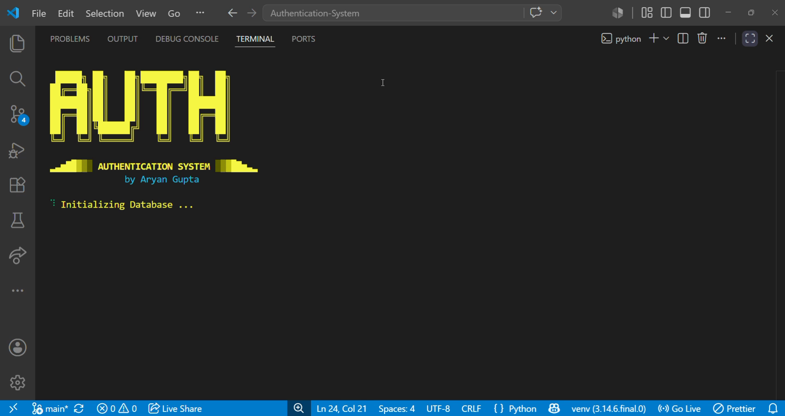

### 🏠 Main Menu
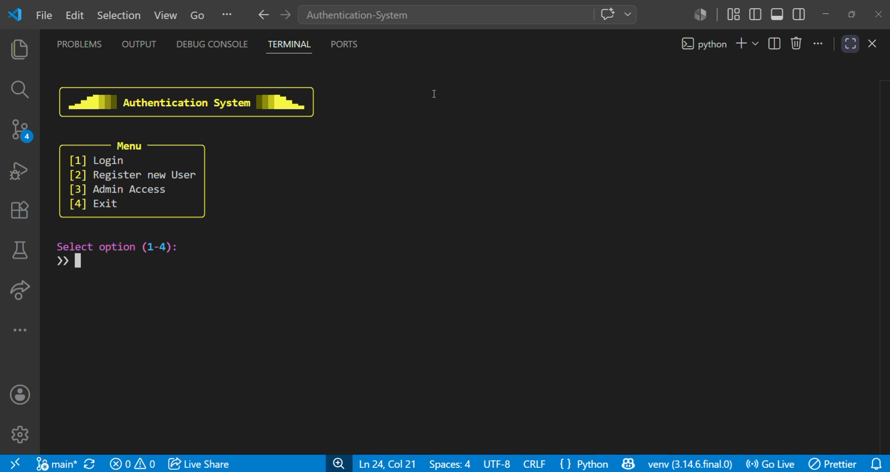

### 📝 User Registration
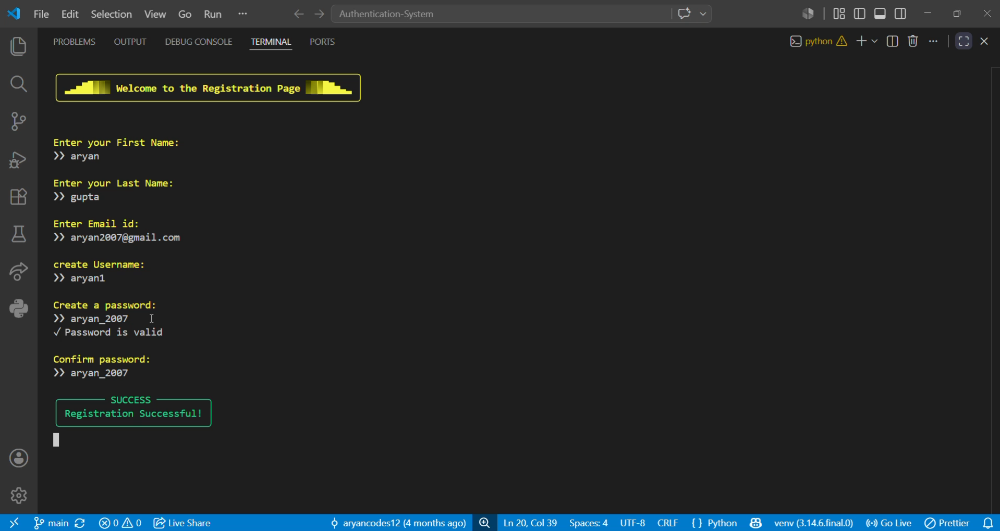

### 🔑 User Login
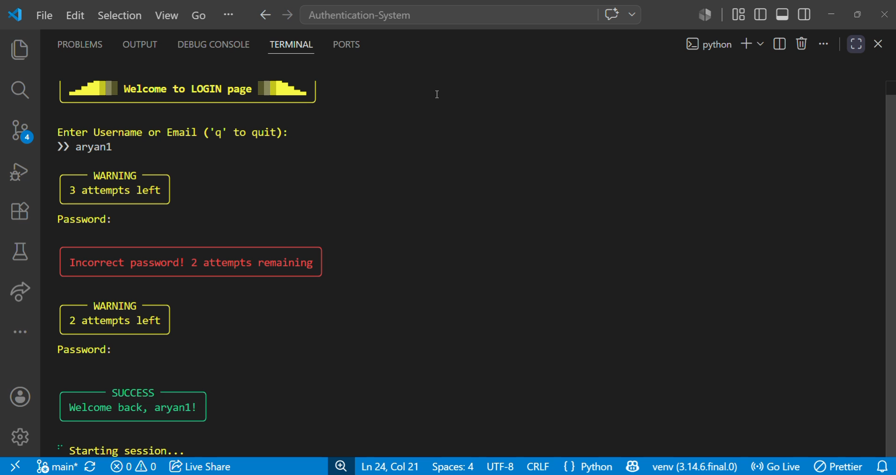

### 👤 User Dashboard
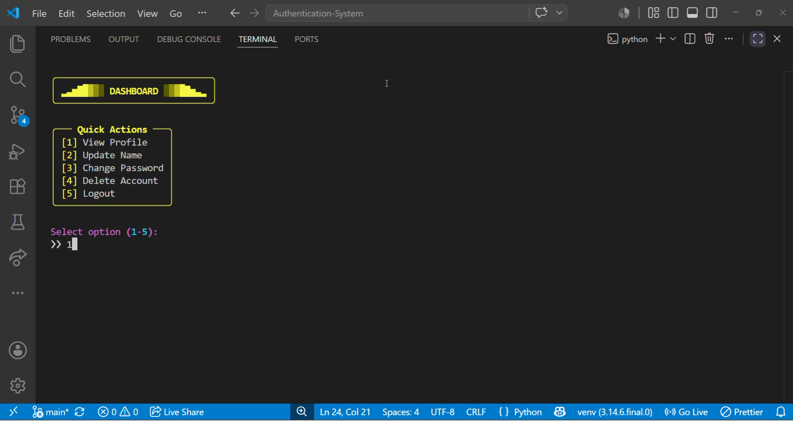

### 📄 View Profile
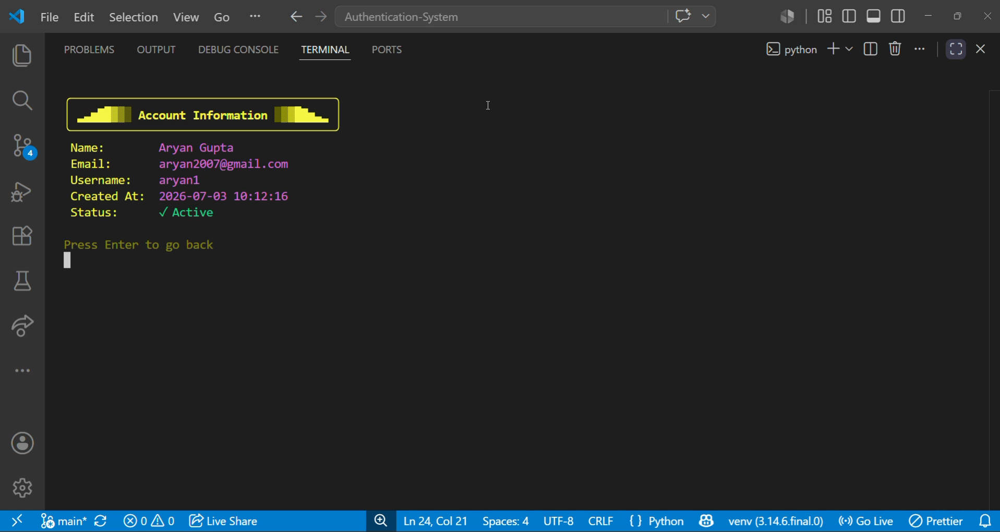

### ✏️ Update Name
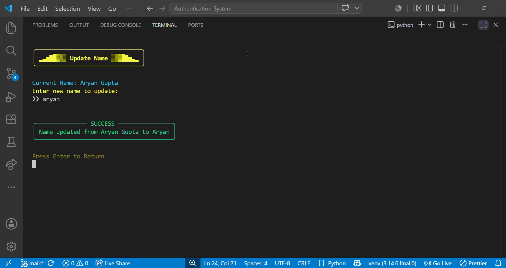

### 🔒 Change Password
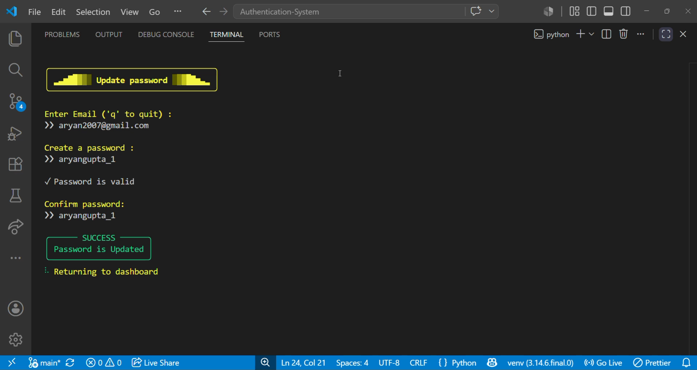

### 🗑️ Delete Account
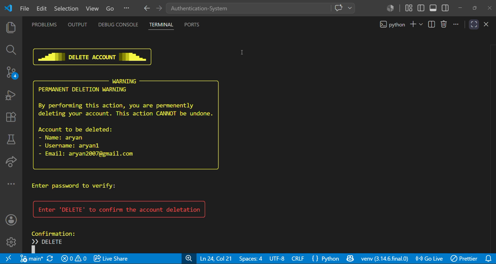

### 👋 Exit
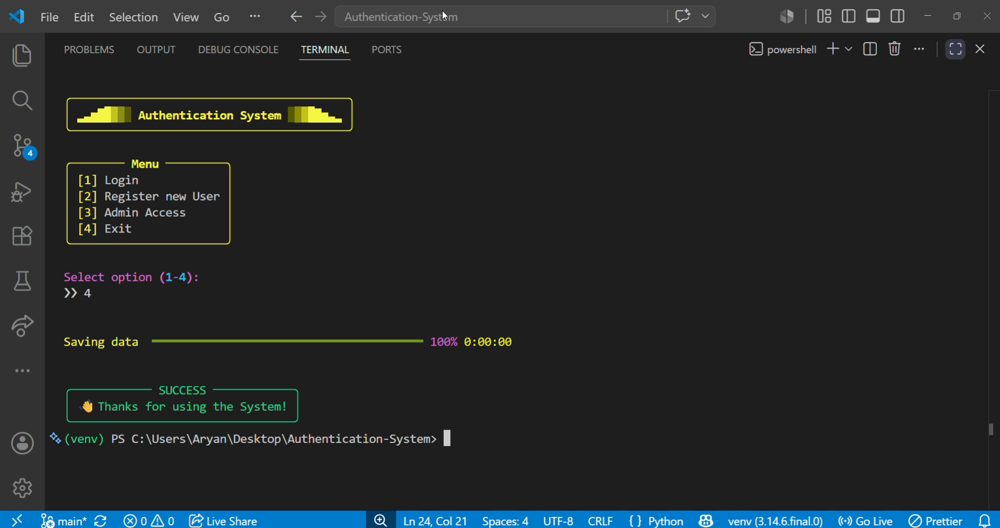

## 🗄️ Database Schema

The application uses a MySQL database to store user information securely.

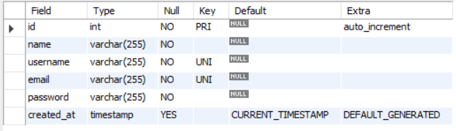


## ✨ Features

### 🔐 **Core Authentication**
- ✅ User registration with comprehensive validation
- ✅ Secure login with username OR email
- ✅ Session management (login/logout)
- ✅ Password strength requirements (8+ chars, numbers, special characters)
- ✅ Password hashing with bcrypt
- ✅ Login attempt limiting (3 attempts maximum)
- ✅ Input sanitization and validation
- ✅ MySQL-backed user authentication and persistence

### 👤 **User Management**
- ✅ View profile information
- ✅ Update display name
- ✅ Change password with validation
- ✅ Delete account with password confirmation
- ✅ Secure logout with session cleanup

### 🎨 **Terminal UI**
- ✅ Cyberpunk-themed interface with neon colors
- ✅ 25+ reusable UI components
- ✅ Color-coded feedback (success/error/warning)
- ✅ Smooth transitions and loading animations
- ✅ Professional panel layouts
- ✅ 15 customizable themes (Cyberpunk default)

## 🏗️ Project Structure
```
Authentication-System/
│
├── auth/                      # Core authentication and UI module
│   ├── admin_dash.py          # Admin dashboard & account management
│   ├── dashboard.py           # User dashboard & profile management
│   ├── login.py               # Login logic & authentication
│   ├── register.py            # User registration flow
│   ├── sessions.py            # Session state management
│   ├── storage.py             # Local JSON persistence helper
│   ├── theme.py               # Color themes and styling
│   ├── ui.py                  # Terminal UI components
│   └── validators.py          # Input validation functions
│
├── database/                 # MySQL backend helpers
│   ├── config.py             # MySQL connection settings
│   ├── connect.py            # Database/table initialization script
│   ├── get_db.py             # Database connection helper
│   ├── insert.py             # Insert user records
│   ├── select.py             # Query and authentication helpers
│   ├── update.py             # Update profile and password
│   └── delete.py             # Delete user records
├── main.py                   # Application entry point
├── requirements.txt          # Python dependencies
├── README.md                 # This file
└── asset/                    # Demo media and screenshots
```

### 🎯 **Architecture Principles**
- **Modular Design:** Each file has a single, clear responsibility
- **Separation of Concerns:** UI, logic, validation, and storage layers are separated
- **Reusability:** 25+ UI components used throughout the application
- **Clean Code:** Readable, maintainable, and well-documented code

## 🚀 Installation & Usage

### Prerequisites
- Python 3.6 or higher
- pip (Python package manager)
- MySQL server running locally or remotely

### Setup

1. **Clone the repository**
```bash
git clone https://github.com/aryancodes12/Authentication-System.git
cd Authentication-System
```

2. **Install dependencies**
```bash
pip install -r requirements.txt
```

3. **Configure MySQL**
- Edit `database/config.py` with your MySQL connection settings.
- Initialize the users table if needed:
```bash
python database/connect.py
```

4. **Run the application**
```bash
python main.py
```

> Note: The application uses MySQL for complete user persistence. Database initialization is automatic on startup.

## 📖 User Guide

### Main Menu
On launch, you'll see three options:
```
[1] Login
[2] Register new User
[3] Admin Access
[4] Exit
```

### Registration Process
1. Select option `2` from the main menu
2. Enter your details:
   - **First Name** and **Last Name**
   - **Email Address** (must contain @gmail.com)
   - **Username** (must be unique, lowercase)
   - **Password** (requirements below)
   - **Confirm Password**

**Password Requirements:**
- Minimum 8 characters
- At least one number
- At least one special character (@_!#$%^&*)
- Cannot match username

### Login
1. Select option `1` from the main menu
2. Enter your **username** or **email**
3. Enter your **password**
   - You have 3 attempts before being locked out
   - Failed attempts show remaining tries

### Dashboard Features
After successful login:

**[1] View Profile** - Display your account information
- Name, email, username
- Account status

**[2] Update Name** - Change your display name
- Enter new name
- Instant update

**[3] Change Password** - Update your password
- Verify current password
- Enter new password (must meet requirements)
- Confirm new password

**[4] Delete Account** - Permanently delete your account with password confirmation

**[5] Logout** - End your session safely

## 🎨 UI Components

The system includes 25+ professionally designed components:

### Display Components
- `header()` - Cyberpunk ASCII art header with neon effects
- `info_panel()` - Information display panels
- `menu_panel()` - Numbered menu options
- `profile_table()` - User profile data table
- `space()` - Spacing between elements
- `rule()` - Horizontal divider lines

### Feedback Components
- `success()` / `success_panel()` - Green success messages
- `error()` / `error_panel()` - Red error messages
- `warn()` / `warn_panel()` - Yellow warnings
- `info()` - Cyan information messages

### Interactive Components
- `get_input()` - Text input with colored prompts
- `get_choice()` - Menu selection
- `wait_for_enter()` - Pause for user acknowledgment

### Animation Components
- `status()` - Animated spinner with message
- `fake_loading()` - Progress bar animation
- `animated_logo()` - Startup ASCII art animation

## 🎨 Themes

**Active Theme:** Cyberpunk (Neon colors on dark background)

| Element | Color | Usage |
|---------|-------|-------|
| **Primary** | Bright Cyan | Headers, prompts, borders |
| **Secondary** | Bright Magenta | Accents, dividers |
| **Accent** | Bright Yellow | Highlights, menu choices |
| **Success** | Bright Green | Success messages, checkmarks |
| **Error** | Bright Red | Error messages, failures |
| **Warning** | Yellow | Warnings, validation errors |
| **Info** | Cyan | Information, hints |
| **Muted** | Dim Cyan | Less important text |

**Additional Themes Available:**
Sunset, Ocean, Forest, Hacker Terminal, Dark Purple, Fire, Rainbow, Electric, Monochrome, Dracula, Nord, Solarized, Gruvbox, Monokai

> To switch themes: Open `auth/theme.py` and uncomment your preferred theme

## 🔐 Security Implementation

### Current Security Features
✅ Password validation
✅ Login attempt limiting (3 tries)  
✅ Session state management  
✅ Input sanitization  
✅ Username uniqueness checks  

### ⚠️ Security Limitations (Educational Project)

**DO NOT use in production without implementing:**
- ❌ Database encryption
- ❌ HTTPS/SSL
- ❌ Rate limiting
- ❌ Email verification
- ❌ Two-factor authentication
- ❌ Password reset mechanism

These features are planned for future phases (see Roadmap).

## 🛠️ Tech Stack

| Component | Technology | Purpose |
|-----------|-----------|---------|
| **Language** | Python 3.6+ | Core application logic |
| **Terminal UI** | [Rich](https://github.com/Textualize/rich) | Terminal formatting and layouts |
| **Password Security** | bcrypt | Password hashing |
| **Database** | MySQL + PyMySQL | Persistent user storage and authentication |
| **Local helper** | JSON (storage.py) | Legacy backup storage (to be removed) |

**Dependencies:**
```
bcrypt==5.0.0
cffi==2.0.0
cryptography==49.0.0
markdown-it-py==4.0.0
mdurl==0.1.2
pycparser==3.0
Pygments==2.19.2
PyMySQL==1.2.0
rich==14.3.1
```

## 📊 Project Statistics

- **Total Lines of Code:** 1,312
- **Database helpers:** 7 files
- **Current Phase:** 6 (✅ Complete)

> MySQL migration is complete. All user data is now persisted in MySQL database.

## 🗺️ Development Roadmap

### ✅ Phase 1: Registration (Complete)
- User registration system
- Input validation
- JSON-based storage

### ✅ Phase 2: Refactoring (Complete)
- Modular architecture
- Separated UI components
- Theme system implementation
- Code cleanup and documentation

### ✅ Phase 3: Authentication & Dashboard (Complete)
- Login system with retry logic
- Session management
- User dashboard
- Profile viewing
- Name updates
- Password changes
- Secure logout
- Account Delete 

### ✅ Phase 4: Admin Features (Complete)
- Admin login credentials
- View all registered users 
- Delete user accounts 
- User search and filtering

### ✅ Phase 5: Enhanced Security (Complete)
- ✅ Password hashing with bcrypt
- ✅ Password strength validation (8+ chars, numbers, special chars)
- ✅ Input sanitization and validation
- ℹ️ Future enhancements: 2FA, password reset, account lockout

### ✅ Phase 6: Database Integration (Complete)
- ✅ MySQL database setup with automatic initialization
- ✅ Database schema design and users table creation
- ✅ Complete migration from JSON to MySQL
- ✅ Automatic database and table creation on application startup
- ✅ Admin data auto-initialization on first run

## 🐛 Known Issues

- Email validation currently only accepts @gmail.com addresses 
- Session doesn't persist after application restart
- No password recovery mechanism yet

## 💡 What I Learned

Building this project taught me:
- ✅ Authentication flow patterns
- ✅ Input validation strategies
- ✅ Session state management
- ✅ Modular code architecture
- ✅ Terminal UI/UX design principles
- ✅ Security considerations in auth systems
- ✅ Error handling and user feedback
- ✅ Code reusability through components

## 🤝 Contributing

This is a personal learning project, but feedback and suggestions are welcome!

1. Fork the repository
2. Create a feature branch (`git checkout -b feature/AmazingFeature`)
3. Commit your changes (`git commit -m 'Add some AmazingFeature'`)
4. Push to the branch (`git push origin feature/AmazingFeature`)
5. Open a Pull Request


## 👨‍💻 Author

**Aryan Gupta**
- 🎓 B.Sc. Data Science & AI Student
- 📧 Email: [aryansynthh@gmail.com](mailto:aryansynthh@gmail.com)
- 💼 LinkedIn: [Aryan Rajesh Gupta](https://www.linkedin.com/in/aryan-rajesh-gupta-386449360)
- GitHub: [@aryancodes12](https://github.com/aryancodes12)
- Project: [Authentication-System](https://github.com/aryancodes12/Authentication-System)

*First-year B.Sc. Data Science & AI Student*

## 🙏 Acknowledgments

- [Rich](https://github.com/Textualize/rich) library by Will McGugan for beautiful terminal formatting
- Python community for excellent documentation and learning resources
- Inspiration from real-world authentication systems


---

⭐ **If you found this project helpful, please consider giving it a star!**

Built with 💙 by [Aryan Gupta](https://github.com/aryancodes12) | Learning by Building 🚀

*Last Updated: 2 July 2026 | Phase 6 in progress* 
